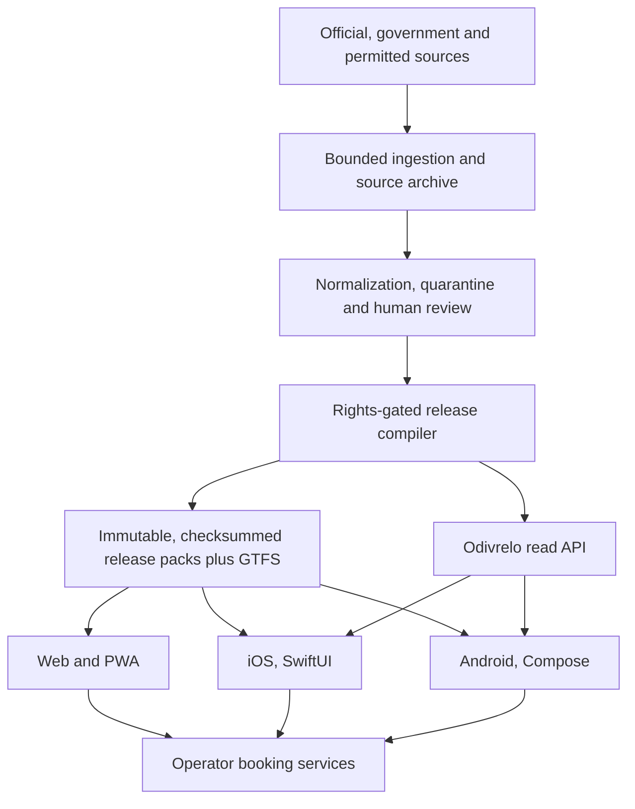

<div align="center">


# Odivrelo

### Greece by coach, with certainty.

Odivrelo helps travellers find intercity coach journeys in Greece, understand
exactly where to board, and reach the correct operator's ticket purchase page.
See when each fact was checked and which source supports it.

[](docs/beta/RELEASE-NOTES.md)
[](#data-mode-demonstration-only)
[](#platforms)
[](LICENSE)

</div>

## What Odivrelo is

Greece's intercity coach network is run by dozens of independent KTEL
operators, each with its own site, its own timetable format and its own
terminal. The hard part is not finding *a* coach. It is being sure of the one
you need: the right date, the right terminal, the right bay, and a booking
route that actually works.

Odivrelo is a certainty layer over that. It answers four questions and shows its
working for each:

1. **Does this journey run on the date I am travelling?**
2. **Where exactly do I board?** Not the city. The terminal, and the bay.
3. **How do I buy a ticket officially?** Or, when there is no online sale, the
   verified ticket office, address, phone and opening hours.
4. **How stale is what you just told me, and who said it?**

Odivrelo never sells or issues tickets. It hands you to the operator.

The name is invented. It is not a Greek word and it is not claimed to
translate to anything. `odivrelo.com` is a proposed domain only; the product
lives at `odivrelo.peterdsp.dev`.

## Data mode: demonstration only

**This 1.0.0 beta ships invented data.** Every journey, terminal and operator
you can see belongs to a fictional region called **Aloria**, which does not
exist. No departure shown is real. Every client says so on screen, in all three
languages, and the web release is marked `noindex`.

That is not a shortcut. It is what the evidence allows:

- All 62 KTEL federation operator directory sources in
  [`data/operators/registry.json`](data/operators/registry.json) are
  `rightsStatus: unknown`. No operator permission is in hand.
- The one rights-cleared national source, the Greek National Access Point's
  long-distance bus dataset, is **ODbL-licensed but was last updated on
  1 December 2020**. It contains **no boarding points, no coordinates and no
  stop identifiers**, only free-text city names, and the word *Delphi* appears
  in it **zero times**. Full dated evidence:
  [PHASE0-02 findings](docs/phase0/NAP-DATASET-EVIDENCE.md).

So the engineering is complete and the dataset is honest about itself.
Switching to real data is a rights-and-review event, not a rewrite: the
`dataMode` field flips, the notices disappear, indexing turns on, and no client
code changes. What it would take is written down in
[EXTERNAL-BLOCKERS.md](docs/beta/EXTERNAL-BLOCKERS.md).

Odivrelo would rather show you a missing journey than an invented one.

## Product principles

- **Evidence before coverage.** A missing journey beats an invented journey.
- **One national search.** Operator boundaries are not the traveller's problem.
- **Offline where it matters.** Reviewed schedules and stop data stay useful on
  a bad connection, and say which cached release they came from.
- **Official booking handoff.** Odivrelo informs and routes. Operators without
  electronic ticketing get a verified contact and ticket-office fallback.
- **Passenger-owned travel wallet.** Saved trips and explicitly imported
  tickets stay on the device. No push service ever receives a ticket, a
  barcode, a passenger name or a booking reference.
- **Visible freshness.** Every fact carries when it was checked and what
  supports it.
- **Privacy by default.** No account, no analytics, no trackers.
- **Accessible to everyone.** Screen readers, dynamic text, keyboard, contrast
  and reduced motion are release gates, not polish.

Greek, English and Albanian are all first-class.

## Platforms

| Target | Implementation | State |
|---|---|---|
| Web, mobile and desktop | React, TypeScript, Vite, installable PWA | deployed at `odivrelo.peterdsp.dev` |
| iPhone and iPad, including iPhone Duo | SwiftUI, MapKit, shared Kotlin core | native app |
| Android phones, tablets and foldables | Jetpack Compose, shared Kotlin core | native app |
| Backend and ingestion | Python, FastAPI, SQLite | service and governed release pipeline |

Desktop coverage is deliberately Web and PWA. There is no native desktop
binary, no watch app, no TV app and no spatial app, and none is claimed.

Per-platform build, verification and distribution status, with evidence, is in
[docs/beta/TEST-MATRIX.md](docs/beta/TEST-MATRIX.md) and
[docs/beta/RELEASE-READINESS.md](docs/beta/RELEASE-READINESS.md).

## Architecture



Two databases, always. An ingestion database holds candidates, provenance and
review state. A compiled public database holds only rows that are both
**approved by a reviewer** and **sourced from a rights-cleared source**. The
compiler refuses to mix them, the manifest is written last, and one previous
release is retained so a rollback has a target.

Service-date semantics, `Europe/Athens`, midnight crossings, GTFS times beyond
24:00 and daylight-saving transitions are resolved **once**, server-side, and
tested. No client reimplements a timetable engine.

See [Architecture](docs/ARCHITECTURE.md),
[Data governance](docs/DATA_GOVERNANCE.md) and the
[beta architecture decisions](docs/beta/ARCHITECTURE-DECISIONS.md).

## Repository layout

```text
.
├── brand.json            Single source of product identity
├── apps/
│   ├── android/          Jetpack Compose application
│   ├── ios/              SwiftUI application
│   └── web/              React PWA, the public 1.0.0 release
├── shared/
│   ├── core/             Kotlin Multiplatform domain, network, database
│   └── features/         Shared mobile feature logic
├── server/
│   ├── api/              Public read API and private review surface
│   ├── ktel-staging/     Compiler, GTFS export, release packs
│   └── src/              Bounded source acquisition pipeline
├── data/
│   ├── schemas/          Versioned public contracts, OpenAPI and JSON Schema
│   ├── fixtures/         The labelled Aloria demonstration dataset
│   └── operators/        Operator registry and source rights
├── design/               Tokens, brand marks, brand board
├── ops/raspberry-pi/     Daily acquisition deployment
├── scripts/              Reproducible build, check and release commands
└── docs/beta/            Delivery ledger, evidence and release gates
```

## Running it

```bash
# Data pipeline: migrate, seed, import, review, publish, pack, verify
python3.12 -m venv .venv
PY=.venv/bin/python bash scripts/ci-pipeline-smoke.sh

# Web
cd apps/web && npm ci && npm run dev

# Shared core and Android
JAVA_HOME=/opt/homebrew/opt/openjdk@21 ./gradlew :shared:core:allTests
JAVA_HOME=/opt/homebrew/opt/openjdk@21 ./gradlew :apps:android:assembleDebug

# iOS
bash scripts/shared-build-xcframework.sh
open apps/ios/Odivrelo.xcodeproj
```

Full, exact steps including signing, deployment and rollback:
[docs/beta/BUILD-AND-RELEASE.md](docs/beta/BUILD-AND-RELEASE.md).
The Phase 0 data runbook is [docs/phase0/RUNBOOK.md](docs/phase0/RUNBOOK.md).

## Documentation

[docs/INDEX.md](docs/INDEX.md) is the map. The delivery ledger for this release
lives in [docs/beta/](docs/beta/):

- [EXECUTION-STATUS.md](docs/beta/EXECUTION-STATUS.md), what is done and what is not
- [BRAND-DECISION.md](docs/beta/BRAND-DECISION.md), the name, its screening and its limits
- [ARCHITECTURE-DECISIONS.md](docs/beta/ARCHITECTURE-DECISIONS.md), dated decisions
- [TEST-MATRIX.md](docs/beta/TEST-MATRIX.md), evidence per platform
- [RELEASE-READINESS.md](docs/beta/RELEASE-READINESS.md), the gates
- [EXTERNAL-BLOCKERS.md](docs/beta/EXTERNAL-BLOCKERS.md), what is missing and exactly what would unblock it
- [RELEASE-NOTES.md](docs/beta/RELEASE-NOTES.md)

Documents written before 30 September 2026 carry the product's first former
name, HodoMap, and are marked as historical. Its second former name, Poravia,
was used until the product was renamed Odivrelo on 1 October 2026. Dated
records keep the name they were written under; they are preserved, not
rewritten.

## Contributing and security

Start with [CONTRIBUTING.md](CONTRIBUTING.md). Changes to timetable logic,
source adapters, entity matching or public data need fixtures and evidence.
Security issues follow [SECURITY.md](SECURITY.md), not a public issue.

## License and independence

Odivrelo's source code is licensed under the
[Apache License 2.0](LICENSE). That license grants no rights to third-party
timetables, maps, operator logos, trademarks or booking-system data. Dataset
publication follows each source's recorded terms and the rules in
[DATA_GOVERNANCE.md](docs/DATA_GOVERNANCE.md).

Odivrelo is an independent project. It is not affiliated with, endorsed by or
operated by the KTEL federation, any regional KTEL operator, TicketWeb or their
technology providers. Operator names and trademarks remain the property of
their respective owners.

Corrections and takedown requests: `info@peterdsp.dev`.
